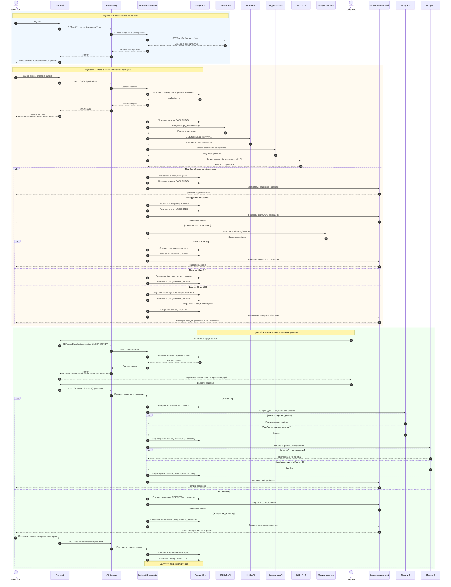

# Sequence Diagram: Взаимодействие систем при обработке заявки

```mermaid
sequenceDiagram
    autonumber
    actor Applicant as Заявитель
    participant Web as Frontend
    participant GW as API Gateway
    participant Orch as Backend Orchestrator
    participant DB as PostgreSQL
    participant Registry as ЕГРЮЛ API
    participant FNS as ФНС API
    participant Fedresurs as Федресурс API
    participant RNP as ЕИС / РНП
    participant AI as Модуль скоринга
    actor Operator as Оператор
    participant Notify as Сервис уведомлений
    participant M2 as Модуль 2
    participant M3 as Модуль 3

    rect rgb(240, 248, 255)
        Note over Applicant,Registry: Сценарий 1. Автозаполнение по ИНН
        Applicant->>Web: Ввод ИНН
        Web->>GW: GET /api/v1/companies/suggest?inn=...
        GW->>Orch: Запрос сведений о предприятии
        Orch->>Registry: GET /egrul/v1/company?inn=...
        Registry-->>Orch: Сведения о предприятии
        Orch-->>GW: Данные предприятия
        GW-->>Web: 200 OK
        Web-->>Applicant: Отображение предзаполненной формы
    end

    rect rgb(255, 250, 240)
        Note over Applicant,DB: Сценарий 2. Подача и автоматическая проверка
        Applicant->>Web: Заполнение и отправка заявки
        Web->>GW: POST /api/v1/applications
        GW->>Orch: Создание заявки
        Orch->>DB: Сохранить заявку со статусом SUBMITTED
        DB-->>Orch: application_id
        Orch-->>GW: Заявка создана
        GW-->>Web: 201 Created
        Web-->>Applicant: Заявка принята

        Orch->>DB: Установить статус DATA_CHECK

        Orch->>Registry: Получить юридический статус
        Registry-->>Orch: Результат проверки
        Orch->>FNS: GET /fns/v1/tax-debts?inn=...
        FNS-->>Orch: Сведения о задолженности
        Orch->>Fedresurs: Запрос сведений о банкротстве
        Fedresurs-->>Orch: Результат проверки
        Orch->>RNP: Запрос сведений о включении в РНП
        RNP-->>Orch: Результат проверки

        alt Ошибка обязательной проверки
            Orch->>DB: Сохранить ошибку интеграции
            Orch->>DB: Оставить заявку в DATA_CHECK
            Orch->>Notify: Уведомить о задержке обработки
            Notify-->>Applicant: Проверка задерживается
        else Обнаружен стоп-фактор
            Orch->>DB: Сохранить стоп-фактор и его код
            Orch->>DB: Установить статус REJECTED
            Orch->>Notify: Передать результат и основание
            Notify-->>Applicant: Заявка отклонена
        else Стоп-факторы отсутствуют
            Orch->>AI: POST /api/v1/scoring/evaluate
            AI-->>Orch: Скоринговый балл

            alt Балл от 0 до 59
                Orch->>DB: Сохранить результат скоринга
                Orch->>DB: Установить статус REJECTED
                Orch->>Notify: Передать результат и основание
                Notify-->>Applicant: Заявка отклонена
            else Балл от 60 до 79
                Orch->>DB: Сохранить балл и результат проверки
                Orch->>DB: Установить статус UNDER_REVIEW
            else Балл от 80 до 100
                Orch->>DB: Сохранить балл и рекомендацию APPROVE
                Orch->>DB: Установить статус UNDER_REVIEW
            else Некорректный результат скоринга
                Orch->>DB: Сохранить ошибку скоринга
                Orch->>Notify: Уведомить о задержке обработки
                Notify-->>Applicant: Проверка требует дополнительной обработки
            end
        end
    end

    rect rgb(240, 255, 240)
        Note over Operator,DB: Сценарий 3. Рассмотрение и принятие решения

        Operator->>Web: Открыть очередь заявок
        Web->>GW: GET /api/v1/applications?status=UNDER_REVIEW
        GW->>Orch: Запрос списка заявок
        Orch->>DB: Получить заявки для рассмотрения
        DB-->>Orch: Список заявок
        Orch-->>GW: Данные заявок
        GW-->>Web: 200 OK
        Web-->>Operator: Отображение заявок, баллов и рекомендаций

        Operator->>Web: Выбрать решение
        Web->>GW: POST /api/v1/applications/{id}/decision
        GW->>Orch: Передать решение и основание

        alt Одобрение
            Orch->>DB: Сохранить решение APPROVED
            Orch->>M2: Передать данные одобренного проекта
            alt Модуль 2 принял данные
                M2-->>Orch: Подтверждение приёма
            else Ошибка передачи в Модуль 2
                M2-->>Orch: Ошибка
                Orch->>DB: Зафиксировать ошибку и повторную отправку
            end

            Orch->>M3: Передать финансовые условия
            alt Модуль 3 принял данные
                M3-->>Orch: Подтверждение приёма
            else Ошибка передачи в Модуль 3
                M3-->>Orch: Ошибка
                Orch->>DB: Зафиксировать ошибку и повторную отправку
            end

            Orch->>Notify: Уведомить об одобрении
            Notify-->>Applicant: Заявка одобрена

        else Отклонение
            Orch->>DB: Сохранить решение REJECTED и основание
            Orch->>Notify: Уведомить об отклонении
            Notify-->>Applicant: Заявка отклонена

        else Возврат на доработку
            Orch->>DB: Сохранить замечания и статус NEEDS_REVISION
            Orch->>Notify: Передать замечания заявителю
            Notify-->>Applicant: Заявка возвращена на доработку
            Applicant->>Web: Исправить данные и отправить повторно
            Web->>GW: POST /api/v1/applications/{id}/resubmit
            GW->>Orch: Повторная отправка заявки
            Orch->>DB: Сохранить изменения и историю
            Orch->>DB: Установить статус SUBMITTED
            Note over Orch,DB: Запустить проверки повторно
        end
    end
```