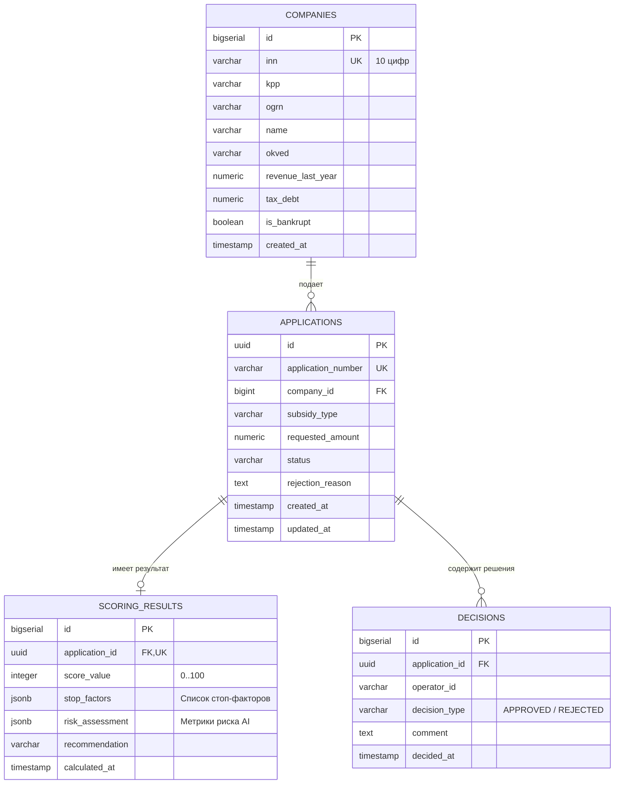

```mermaid
erDiagram
    COMPANIES ||--o{ APPLICATIONS : "подает"
    APPLICATIONS ||--o| SCORING_RESULTS : "имеет результат"
    APPLICATIONS ||--o{ DECISIONS : "содержит решения"

    COMPANIES {
        bigserial id PK
        varchar inn UK "10 цифр"
        varchar kpp
        varchar ogrn
        varchar name
        varchar okved
        numeric revenue_last_year
        numeric tax_debt
        boolean is_bankrupt
        timestamp created_at
    }

    APPLICATIONS {
        uuid id PK
        varchar application_number UK
        bigint company_id FK
        varchar subsidy_type
        numeric requested_amount
        varchar status
        text rejection_reason
        timestamp created_at
        timestamp updated_at
    }

    SCORING_RESULTS {
        bigserial id PK
        uuid application_id FK, UK
        integer score_value "0..100"
        jsonb stop_factors "Список стоп-факторов"
        jsonb risk_assessment "Метрики риска AI"
        varchar recommendation
        timestamp calculated_at
    }

    DECISIONS {
        bigserial id PK
        uuid application_id FK
        varchar operator_id
        varchar decision_type "APPROVED / REJECTED"
        text comment
        timestamp decided_at
    }
```